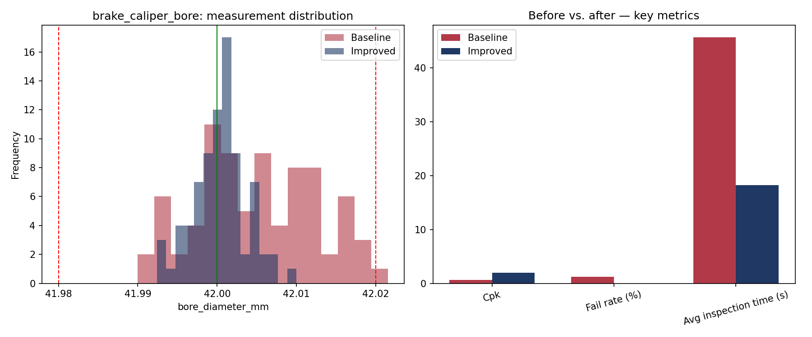

# Process Optimization Report — Brake caliper piston bore (hydraulic sealing surface)

**Part:** `brake_caliper_bore`  |  **Nominal:** 42.0000 mm  |  **Tolerance:** ±0.0200 mm  |  **Gauge:** Bore gauge (dial/digital)

## Baseline vs. Improved Process

| Metric | Baseline | Improved | Change |
|---|---|---|---|
| Parts inspected | 80 | 80 | - |
| Failed parts | 1 | 0 | - |
| Fail rate | 1.2% | 0.0% | +1.2 pp |
| Process mean | 42.0049 | 42.0003 | - |
| Std. dev. | 0.0075 | 0.0034 | 54.4% reduction |
| Cp | 0.89 | 1.96 | - |
| Cpk | 0.67 | 1.93 | - |
| Avg. inspection time | 45.6s | 18.2s | 60% faster |

## Interpretation

- **Capability:** Not capable (Cpk < 1.00) - process centering/variation needs correction. (baseline) -> Capable (Cpk >= 1.33) - process comfortably meets tolerance. (improved).
- **Inspection cycle time** dropped by about 60%, consistent with switching from a manual gauge + paper log to a digital gauge with direct data capture.
- **Fail rate** changed by +1.2 percentage points after the simulated corrective action (tool-offset correction / improved fixturing).

## Chart

