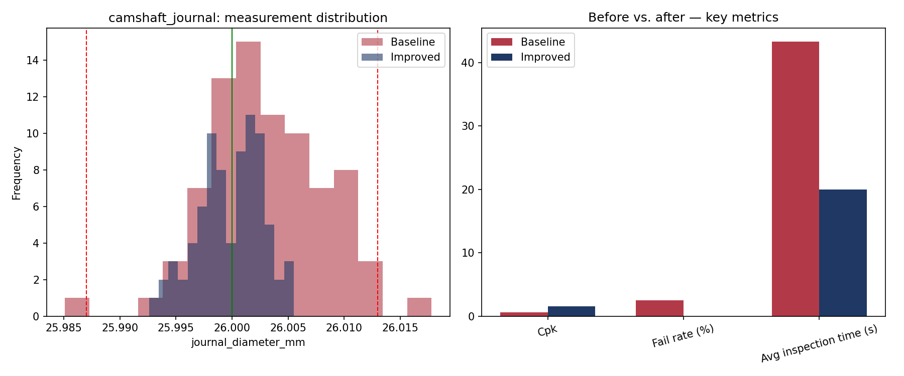

# Process Optimization Report — Camshaft journal diameter (plain bearing fit)

**Part:** `camshaft_journal`  |  **Nominal:** 26.0000 mm  |  **Tolerance:** ±0.0130 mm  |  **Gauge:** Micrometer

## Baseline vs. Improved Process

| Metric | Baseline | Improved | Change |
|---|---|---|---|
| Parts inspected | 80 | 80 | - |
| Failed parts | 2 | 0 | - |
| Fail rate | 2.5% | 0.0% | +2.5 pp |
| Process mean | 26.0030 | 25.9999 | - |
| Std. dev. | 0.0053 | 0.0028 | 46.9% reduction |
| Cp | 0.81 | 1.53 | - |
| Cpk | 0.63 | 1.52 | - |
| Avg. inspection time | 43.3s | 20.0s | 54% faster |

## Interpretation

- **Capability:** Not capable (Cpk < 1.00) - process centering/variation needs correction. (baseline) -> Capable (Cpk >= 1.33) - process comfortably meets tolerance. (improved).
- **Inspection cycle time** dropped by about 54%, consistent with switching from a manual gauge + paper log to a digital gauge with direct data capture.
- **Fail rate** changed by +2.5 percentage points after the simulated corrective action (tool-offset correction / improved fixturing).

## Chart

