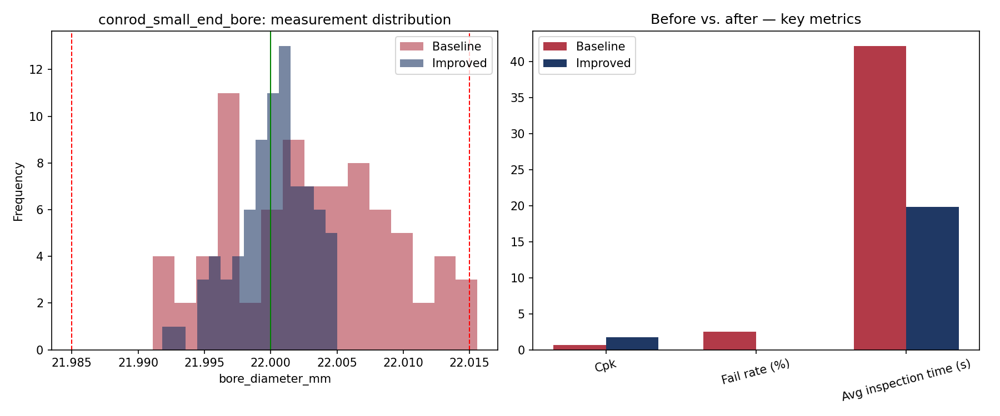

# Process Optimization Report — Connecting rod small-end bore (piston pin fit)

**Part:** `conrod_small_end_bore`  |  **Nominal:** 22.0000 mm  |  **Tolerance:** ±0.0150 mm  |  **Gauge:** Bore gauge (dial/digital)

## Baseline vs. Improved Process

| Metric | Baseline | Improved | Change |
|---|---|---|---|
| Parts inspected | 80 | 80 | - |
| Failed parts | 2 | 0 | - |
| Fail rate | 2.5% | 0.0% | +2.5 pp |
| Process mean | 22.0030 | 22.0001 | - |
| Std. dev. | 0.0062 | 0.0029 | 53.8% reduction |
| Cp | 0.81 | 1.75 | - |
| Cpk | 0.65 | 1.74 | - |
| Avg. inspection time | 42.1s | 19.8s | 53% faster |

## Interpretation

- **Capability:** Not capable (Cpk < 1.00) - process centering/variation needs correction. (baseline) -> Capable (Cpk >= 1.33) - process comfortably meets tolerance. (improved).
- **Inspection cycle time** dropped by about 53%, consistent with switching from a manual gauge + paper log to a digital gauge with direct data capture.
- **Fail rate** changed by +2.5 percentage points after the simulated corrective action (tool-offset correction / improved fixturing).

## Chart

