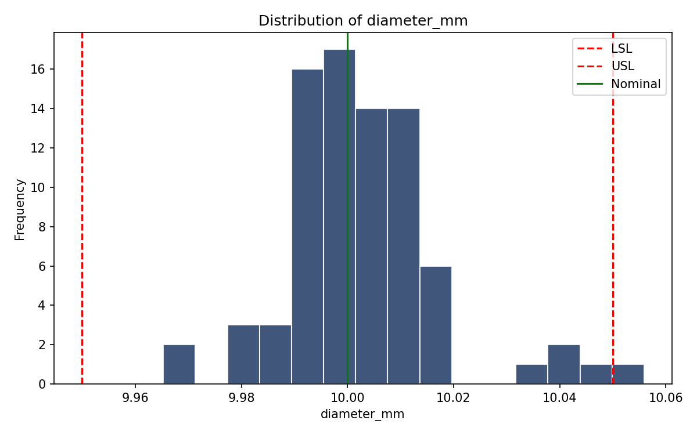
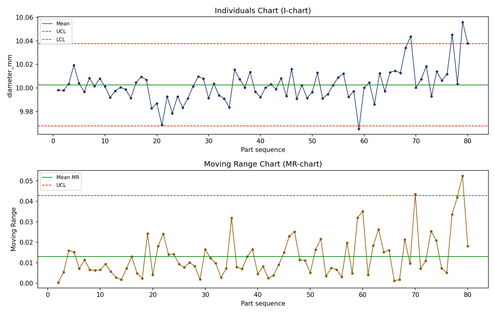

# Dimensional Quality Inspection Report

**Input file:** `bore_diameter_measurements.csv`  
**Measurement:** `diameter_mm`  
**Nominal:** 10.0000  |  **Tolerance:** ±0.0500  |  **LSL:** 9.9500  |  **USL:** 10.0500

## Summary

- Parts inspected: **80**
- Passed: **79**
- Failed: **1** (1.2%)
- Process mean: **10.0027**
- Process std. dev.: **0.0149**
- Cp: **1.12**
- Cpk: **1.06** — Marginally capable (1.00 <= Cpk < 1.33) - monitor closely.

## Failed Parts

| Part ID | Measurement | Result |
|---|---|---|
| P0079 | 10.0559 | FAIL |

## Control Chart — Out-of-Control Points

UCL: 10.0376 | LCL: 9.9678

Sequence positions flagged as out-of-control: [59, 69, 77, 79, 80]

This pattern is consistent with a gradual process shift (e.g. tool wear) rather than a single random outlier, and warrants a tooling/setup check.

## Charts

## Recommended Corrective Actions

- Inspect and, if needed, replace/adjust the tool on the flagged machine.
- Re-measure parts produced after the first out-of-control point.
- Tighten the inspection interval until the process is confirmed stable.